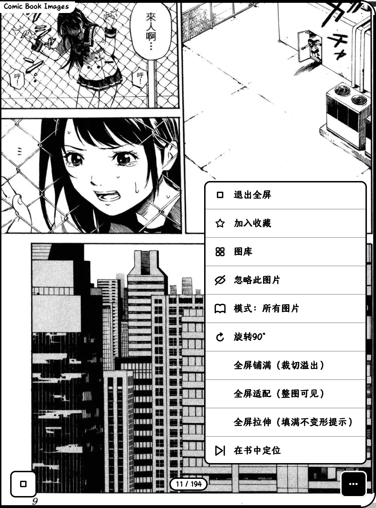
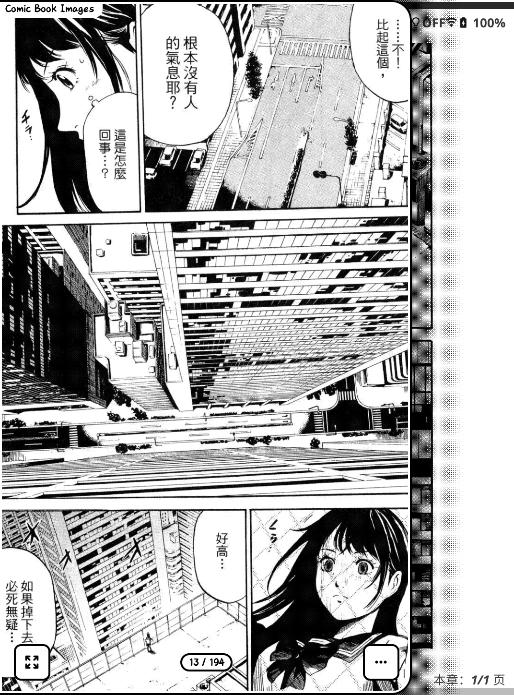
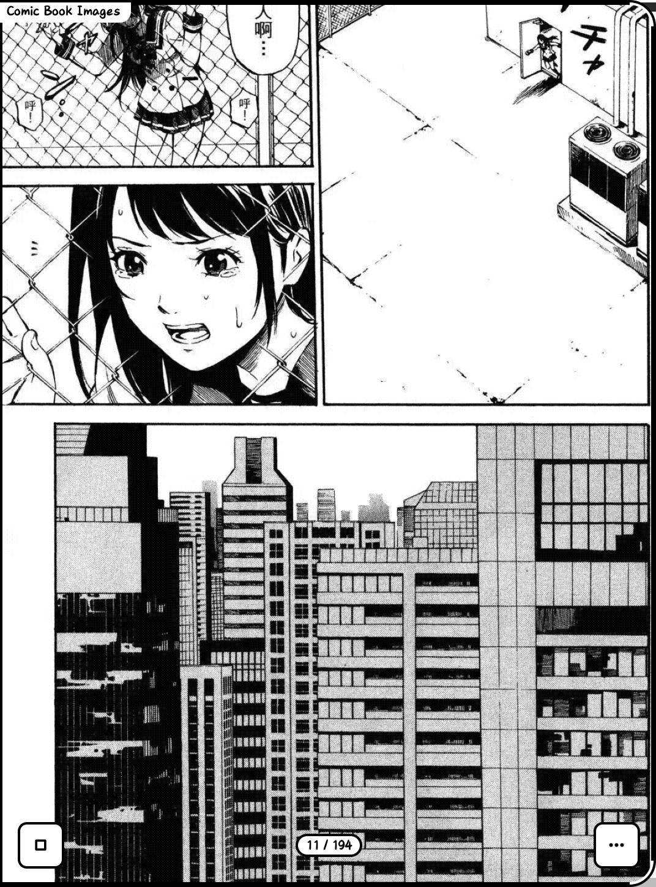
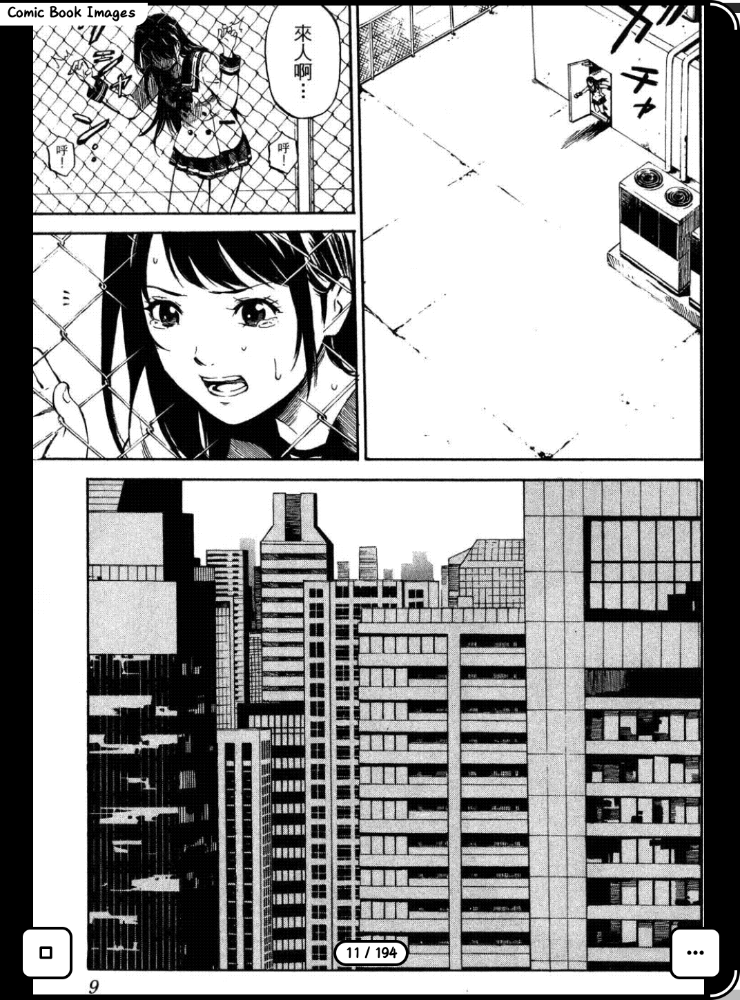
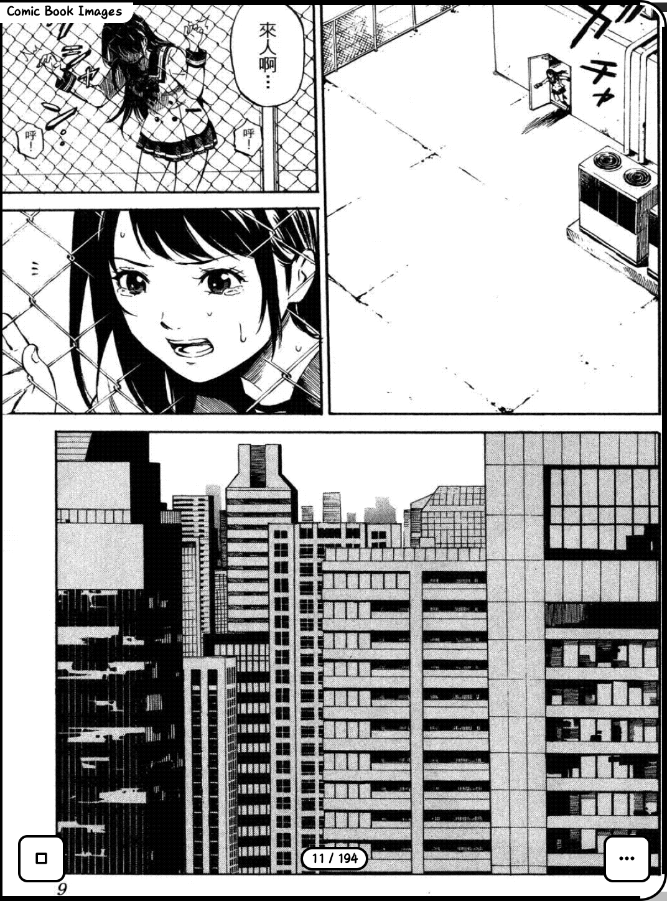

# 美术馆 / ArtGallery — KOReader 看图插件

> 中文说明在上，English below. / Chinese description first, English below.

---

## 简介 / Introduction

**中文**：美术馆（ArtGallery）是 [KOReader](https://github.com/koreader/koreader) 的一款看图插件，原名 **Mirador**，由 **Glimpse** 合并 **Illustrations** 的全屏看图能力而来。它让你在阅读电子书时直接浏览书中的地图、族谱、参考图、漫画分镜等图片，**不丢失阅读位置**；支持抽屉式缩略图预览与一键全屏沉浸式查看，可缩放、平移、旋转、收藏。

**English**: ArtGallery (美术馆) is a KOReader plugin for viewing images embedded in books — such as maps, family trees, reference illustrations, and comic panels — without losing your reading position. Originally named **Mirador**, it merges the fullscreen image-viewing capability of **Illustrations** into **Glimpse**. It offers a drawer thumbnail preview and one-tap immersive fullscreen viewing, with zoom, pan, rotate, and favorite support.

---

## 支持格式 / Supported formats

**中文**：本插件按使用场景支持以下格式，并非「KOReader 能打开的都支持」：
- **EPUB** — 滚动文档（小说、带地图 / 族谱的参考书），美术馆**内置画廊**的原生强项：在任意 EPUB 阅读界面一键打开本书图片浏览器，全套过滤 / 收藏 / 忽略 / 进度同步能力均可用；
- **CBZ** — 漫画压缩包，经文件管理器「浏览 CBZ 漫画」菜单入口，用美术馆全屏翻阅其页面图片（每页即一张图，不做相关性过滤）；
- **PDF / DjVu** — **暂不支持**：美术馆对这两类分页文档会提示「仅支持 EPUB 格式」，请勿用本插件浏览其中的图片。

只要书籍是上述受支持格式（EPUB / CBZ）且其中包含可被提取的图片（地图、族谱、漫画分镜、插图等），即可用本插件浏览；纯文本无图书籍不适用。

**English**: This plugin supports the following formats by use-case — not "every format KOReader can open":
- **EPUB** — scrolling documents (novels, reference books with maps / family trees); the native strength of the **in-book gallery**: open the image browser for the current book from any EPUB reading screen, with full filtering / favorites / ignore / progress-sync support;
- **CBZ** — comic archives, opened via the file-manager **"Browse CBZ comics"** menu entry; the gallery pages through the archive's images full-screen (each page is one image, no relevance filtering);
- **PDF / DjVu** — **not supported yet**: ArtGallery tells you "only EPUB is supported" for these paged formats, so don't use it to browse images inside PDF / DjVu.

It works whenever the book is in a supported format above (EPUB / CBZ) and contains extractable images (maps, family trees, comic panels, illustrations); plain-text books without images are not applicable.

---

## 功能特色 / Features

> 自 **v1.0.16** 起持续吸收上游 glimpse 能力，新增：**可配置最大放大倍数**、**手势独立开关**、**更聪明的图片相关性过滤**、**图库分段切换器（实时计数）**、**书签入画廊（独立「书签」段 · 可收藏 · 可跳转 · 可删除）**——详见下方 §4 / §5 / §9 / §10 / §11。

### 1. 内置菜单入口，阅读中一键看图 / In-book menu entry

在任意书籍的阅读界面打开顶部菜单，即可看到「美术馆 / ArtGallery」入口，点击后直接进入本书图片浏览器，无需离开当前书籍。

Open the top menu while reading any book to find the **美术馆 / ArtGallery** entry. Tap it to open the image browser for the current book without leaving your reading position.



### 2. 插件级菜单与关于对话框 / Plugin menu & About dialog

插件在 KOReader 的插件列表中注册完整菜单，包含设置项（含「手势」「最大放大倍数」等子菜单）与「关于美术馆 / About ArtGallery」对话框，版本、作者、更新来源一目了然。

The plugin registers a full menu in KOReader's plugin list, including settings (with submenus such as **手势 / Gestures** and **最大放大倍数 / Max zoom**) and the **About ArtGallery / 关于美术馆** dialog, showing version, author, and update source at a glance.


### 3. 抽屉式图片预览 / Drawer-style image preview

从书籍菜单唤出插件后，呈现抽屉式图片列表（即"图库"），列出本书内所有可用图片。轻点任一缩略图即可进入单图查看；退出后自动回到书籍原阅读位置。图库支持按 **全部 / 收藏 / 忽略** 三个图片池过滤查看（见 §9）。

After invoking the plugin from the book menu, a drawer-style image list (the "gallery") appears, showing all available images in the book. Tap any thumbnail to enter single-image view; exiting returns you to the original reading position. The gallery can be filtered by **All / Favorites / Ignored** pools (see §9).



### 4. 全屏沉浸式三态填充 / Immersive fullscreen with three fit modes

进入全屏后自动隐藏功能按钮、页码圆点与标题栏，最大化利用屏幕空间。点击屏幕底部可临时恢复控件，再次点击图片后延迟自动隐藏，双击缩放不受影响。

全屏提供三种填充模式，可在「右 ⋯」菜单中即时切换，**长按某个模式可将其设为默认全屏看图模式**：

- **铺满 (Cover)**：按比例放大直至填满整个屏幕，边缘超出部分被裁切，适合漫画、海报等需要填满画面的场景。
- **适配 (Contain)**：按比例完整显示整张图片，保留全部内容，可能留出黑边，适合地图、图表等不能丢信息的场景。
- **拉伸 (Stretch)**：非等比拉伸填满屏幕，充分利用每一寸显示面积，同时仍支持缩放与平移手势。

- **最大放大倍数可配置**：插件菜单提供「最大放大倍数」设置，可在 **1.5× / 2.0× / 2.5× / 3.0× / 4.0×** 之间选择放大上限（默认 1.5×，保持旧行为）；抽屉态取该上限，全屏态自动翻倍，设置即时生效、无需重启 KOReader。

In fullscreen, buttons, page dots, and captions are auto-hidden to maximize screen usage. Tap the bottom edge to temporarily restore controls; tap the image to auto-hide again. Double-tap zoom remains available.

Three fit modes are available in the `⋯` menu; **long-press a mode to set it as the default fullscreen mode**:

- **Cover**: scales proportionally until the screen is fully filled; edges are cropped. Great for comics and posters.
- **Contain**: shows the entire image proportionally, possibly with letterboxing. Ideal for maps and diagrams.
- **Stretch**: non-uniformly fills the screen, making full use of the display area while still supporting zoom and pan gestures.

- **Configurable max zoom**: the plugin menu offers a **最大放大倍数 / Max zoom** setting, choosing the zoom ceiling among **1.5× / 2.0× / 2.5× / 3.0× / 4.0×** (default 1.5×, preserving old behavior); the drawer uses that ceiling while fullscreen doubles it — applied instantly, no KOReader restart needed.

#### 铺满模式（裁切）/ Cover mode (cropped)



#### 适配模式 / Contain mode



#### 拉伸模式 / Stretch mode



### 5. 完整缩放手势 / Full zoom & pan gestures

- 双击图片：放大 / 还原。
- 双指张开：放大。
- 双指捏合：缩小。
- 按住并拖动：平移查看大图细节。
- 上述手势在 **Cover / Contain / Stretch 三种模式下均可用**，拉伸模式也不例外。

- **手势独立开关**：插件菜单「手势」子菜单可单独开启 / 关闭 **双击放大 / 滑动翻页 / 捏合缩放** 任一手势——按手感或防误触自由定制，关闭后对应手势立即失效、其余不受影响。

- Double-tap: zoom in / restore.
- Two-finger spread: zoom in.
- Two-finger pinch: zoom out.
- Hold and drag: pan to inspect details.
- All gestures work in **Cover, Contain, and Stretch modes**, including Stretch.

- **Per-gesture toggles**: the plugin menu's **手势 / Gestures** submenu lets you independently enable / disable **double-tap zoom / swipe paging / pinch zoom** — customize by feel or to prevent mis-taps; turning one off takes effect immediately without affecting the others.

### 6. 看图同步书籍进度 / Reading-progress sync

看图时自动同步更新书籍本身的阅读进度，避免"看完了漫画、书本进度还停在第一页"。目前受支持的图片文档中，**CBZ（分页）**与 **EPUB（滚动）** 各用独立开关，可按文档类型分别开启或关闭。

Viewing images also advances the book's own reading progress, so your book won't stay on page one after you finish a comic. Among the supported image documents, **CBZ (paged)** and **EPUB (scrolling)** each have a separate toggle you can turn on or off by document type.

### 7. 智能适配与自动选向 / Smart fitting & auto-orientation

全屏查看时自动根据图片宽高比选择最佳屏幕方向，让画面以最大有效面积呈现；同时支持手动切换铺满 / 适配 / 拉伸。

Fullscreen view automatically picks the optimal screen orientation based on image aspect ratio, maximizing usable display area while allowing manual switching among cover / contain / stretch.

### 8. 收藏、缓存清理与搜索记忆 / Favorites, cache, and search memory

- **收藏图片**：快速标记常用图片，方便反复查看；收藏在「图库」中可单独筛选（见 §9）。
- **按书清缓存**：释放单本书籍生成的图片缓存，管理存储空间。
- **全书搜索记忆**：记住在书中的图片搜索状态，退出后再次进入可继续浏览。

- **Favorite images**: mark frequently used images for quick access; favorites can be filtered separately in the gallery (see §9).
- **Per-book cache clearing**: free image caches per book to manage storage.
- **Persistent in-book search memory**: remember your image search state across sessions.

### 9. 图库过滤：双池分段切换器（实时计数）/ Gallery filter: dual-pool segmented switcher with live counts

**中文**：图库（抽屉）底部提供三段式分段控件，直达切换三个图片池，每段实时显示数量：

- **全部 [N]**：本书所有图片（收藏 + 未忽略）。
- **收藏 [F]**：你标记收藏的图片。
- **忽略 [M]**：你选择隐藏的图片（不再出现在「全部」中）。

点按任一分段**直接跳转**到对应池（无需循环）；当前所处池以反相（黑底白字）高亮。仅当确有忽略项时才显示「忽略」段——没有忽略项时只有 全部 / 收藏 两段，外观与旧版一致；若处于「忽略」视图但已无忽略项，会自动回退「全部」，避免空画廊。收藏计数走缓存，频繁切换无性能压力。

**English**: The gallery (drawer) bottom bar offers a three-segment control that jumps straight to one of three image pools, each showing a live count:

- **All [N]**: every image in the book (favorites + not-ignored).
- **Favorites [F]**: images you've starred.
- **Ignored [M]**: images you've chosen to hide (no longer shown under All).

Tap any segment to **switch directly** (no cycling); the active pool is highlighted (inverted, black-on-white). The "Ignored" segment appears only when there are actually ignored items — with none ignored, only All/Favorites show, matching the old look; if the current filter is "ignored" but nothing is ignored, it auto-falls back to All to avoid an empty gallery. The favorite count uses a cache, so frequent switching adds no performance cost.

### 10. 更聪明的图片相关性过滤 / Smarter image relevance filter

**中文**：扫描层会智能判断图片是否值得在图库展示，减少"装饰性留白 / 页眉页脚"等噪声干扰：

- **参考图识别**：按文件名识别地图、族谱、家谱、示意图、图表、曲线图、时间线、信息图等（map / family-tree / pedigree / diagram / chart / graph / timeline / schematic / infographic，词边界匹配避免 remap / photo / logo 误命中），使小尺寸或异形的地图、族谱、图表不再被当作"太小"误杀。
- **图文书自动放宽**：当全书"强参考信号"（真实说明文字、出版方 figure 名、参考图名、或本身已够大）密度足够高（≥ 4 且占全部图片 ≥ 40%）时，判定为图文书，对无说明的小图放宽尺寸下限——但**长宽比测试保持严格**，高瘦的装饰性留白仍会被丢弃。
- 升级后首次打开会自动重扫（扫描层版本号自增，旧缓存失效）。

**English**: The scan layer intelligently decides which images deserve a gallery slot, cutting down noise like decorative whitespace, headers, and footers:

- **Reference-image recognition**: recognizes maps, family trees, pedigrees, diagrams, charts, graphs, timelines, and infographics by filename (word-boundary matched so remap / photo / logo don't false-positive), so small or oddly-shaped maps, family trees, and charts survive the size floor.
- **Illustrated-book auto-relax**: when a book's density of "strong reference signals" (real captions, publisher figure names, reference names, or already-large images) is high enough (≥ 4 and ≥ 40% of all images), it's deemed illustrated and uncaptioned small images keep a relaxed size floor — but the **aspect-ratio test stays strict**, so tall thin decorative chrome is still dropped.
- After an upgrade, books auto re-scan on first open (scan-layer version bump invalidates old caches).

---

### 11. 书签入画廊 / Bookmarks into the gallery

**中文**：开启插件菜单「图库包含书签页」开关（默认关闭，重新打开美术馆生效）后，你在书中手工添加的「狗耳朵」书签页会以缩略图形式出现在图库**独立的「书签」段**（无书签时该段自动隐藏）。书签页可视作一本可视化书签目录，交互完整：

- **轻点书签缩略图**：全屏查看该书签页（先以已渲染缩略图瞬时显示，再异步拉取高清渲染替换）；
- **长按书签**：弹菜单提供「跳转到此页」（一键回到该书签页）/「收藏图片·取消收藏」/「删除书签」；
- **删除书签**：经二次确认后从本书彻底移除该狗耳朵书签，并立即写入本书 `.sdr` 落盘（重开本书不再恢复）；删除后图库网格即时刷新；
- **收藏书签**：走全局收藏分支，生成的 PNG 视作缓存、可被「清除本书图片缓存」清除；收藏的书签在「书签」段右下角显示 ⭐（精准贴于缩略图右下角）。

书签永不进入「忽略」池。渲染委托 KOReader 内置 `ReaderThumbnail` 子进程，非自建引擎。

**English**: Enable the plugin-menu toggle **图库包含书签页 / Include bookmark pages** (off by default; takes effect after reopening ArtGallery), and the "dog-ear" bookmarks you add in a book appear as thumbnails in a **separate Bookmarks tab** in the gallery (auto-hidden when empty). Bookmarks act as a visual bookmark index with full interaction:

- **Tap a bookmark thumbnail**: view that bookmark page full-screen (shows the rendered thumbnail instantly, then swaps in a high-res render asynchronously);
- **Long-press a bookmark**: the menu offers **Jump to this page** (return to that bookmark instantly) / **Favorite · Unfavorite** / **Delete bookmark**;
- **Delete bookmark**: after a confirmation, removes the dog-ear bookmark from the book entirely and writes to the book's `.sdr` immediately (won't return after reopening); the gallery grid refreshes at once;
- **Favorite a bookmark**: goes through the global-favorites branch; the generated PNG is treated as cache (cleared by "Clear this book's image cache"); a favorited bookmark shows a ⭐ at the thumbnail's bottom-right (precisely placed).

Bookmarks never enter the Ignored pool. Rendering delegates to KOReader's built-in `ReaderThumbnail` subprocess, not a custom engine.

---

## 相比上游的改进 / Improvements over the upstreams

**中文**：美术馆（ArtGallery）是 **Glimpse** 与 **Illustrations** 两个 KOReader 社区插件的合并与增强。为表述准确，下面以美术馆的**吸收基线**（Glimpse 截至 v1.2.5、Illustrations 截至 v0.5.2）**分别**对比两个上游：

- **Glimpse** — 作者 Fank1（Erik Fanki）；最新稳定版 **v1.3.0**（2026-08-15）。美术馆吸收其 **v1.2.5** 的能力，并采纳 v1.3.0 的部分内部优化（菜单图标缓存、圆角渲染快填、弹出菜单自动旋转）；v1.3.0 新增的「书签入画廊」由美术馆**独立实现**（见 §11），其「屏上 +/fit/− 缩放控件」与「全局总开关」美术馆未采用（改用双击/捏合与逐项开关）。[github.com/Fank1/glimpse](https://github.com/Fank1/glimpse)
- **Illustrations** — 作者 agaragou；最新 **v0.5.2**（2026-04-25）：[github.com/agaragou/illustrations.koplugin](https://github.com/agaragou/illustrations.koplugin)

> 说明：美术馆是"合并"而非"从零发明"。表中凡标注「同源 / 均具备」的项，表示该能力本就来自对应上游、美术馆继承沿用；标注「美术馆新增 / 增强」的，才是相对该上游的差异化改进。

### 对比 Glimpse v1.2.5

Glimpse 是功能更完整的上游（"随时偷看书中参考图而不丢位置"）。它本身**已具备**：EPUB 智能扫描与过滤（参考图名识别 + 图文书自动放宽）、防剧透范围、记住上次图片（含缩放/平移）、夜间反转、可配置最大放大倍数（150%–400%，默认 200%）、逐手势开关、画廊网格 + 忽略标签页、书签入画廊、旋转、在书中显示、带回滚的就地更新、预发布订阅。

| 维度 | Glimpse v1.2.5 | 美术馆 ArtGallery | 差异 |
| --- | --- | --- | --- |
| 界面语言 | 全英文 | **全中文菜单 + 关于对话框（双语元数据）** | 美术馆新增（中文化） |
| 全屏填充 | 单一"fit"静止视图 + 最大缩放 | **铺满 / 适配 / 拉伸 三态**，可长按设默认；全屏自动隐藏控件 | 美术馆新增三态填充 |
| 漫画 / CBZ | 明确不支持（PDF / 漫画 / manga 弹"格式不支持"） | **CBZ 独立入口**（文件管理器"浏览 CBZ 漫画"） | 美术馆新增 CBZ 浏览 |
| 收藏 | 无收藏（仅有"忽略"与书签） | **全局收藏池**（源自 Illustrations，统一进分段切换器） | 美术馆引入收藏 |
| 图库切换 | 画廊网格 + 分页箭头 + 忽略标签页 + 防剧透模式切换 | **全部 / 收藏 / 忽略 分段直达 + 实时计数**；无忽略项时自动隐藏"忽略"段 | 美术馆统一三池为一控件 |
| 最大放大倍数 | 150%–400% 可配（默认 200%） | 1.5×–4.0× 可配（默认 1.5×） | 同源思路，默认值不同（美术馆更保守） |
| 手势开关 | 双击 / 滑动 / 捏合 各自可关 | 同样可逐项关闭 | 同源 / 均具备 |
| 智能过滤 | 参考图名识别 + 图文书放宽（同引擎） | 同引擎（吸收自 Glimpse） | 同源 / 均具备 |
| 防剧透 | 章节级范围 + 一次性全书搜索 | 三档（全书 / 已读到 / 仅当前章节前） | 均具备，美术馆多一档 |
| 阅读进度 | 刻意"不改动你的位置" | **可主动同步书籍自身进度**（分页 / 滚动分别开关） | 方向相反：Glimpse 不推进，美术馆可选推进 |
| 维护 | 独立仓库、自带更新器 | 合并为单插件，更新器统一指向本仓库 | 装一个即可，无需并存 |

> **关于 Glimpse v1.3.0（2026-08-15）**：上表以美术馆吸收基线 **v1.2.5** 为准。v1.3.0 的核心新增「书签入画廊」美术馆已**独立实现**（独立「书签」段 · 轻点全屏看图 · 长按可跳转/收藏/删除，见 §11），二者机制不同——glimpse 把书签**并入图片池**按阅读顺序穿插，美术馆用**独立段**。v1.3.0 另增「屏上 +/fit/− 缩放控件」与「全局总开关 Enable Glimpse」——美术馆未采用，改用双击↔2× + 捏合缩放与逐项手势/功能开关（更贴合墨水屏免闪烁体验）。其「无闪烁切图 / 菜单提速」对墨水屏无额外收益，美术馆刷新系统本就免闪。

### 对比 Illustrations v0.5.2

Illustrations 是较精简的上游（"浏览 EPUB 中所有插图"）。它本身具备：3×3 网格画廊、全屏插图模式、**全局收藏**（跨书，甚至书外可用）、更新检查、防剧透（当前页之前 / 全部两档）、点按 / 方向键导航、手势**分配**、最小图片尺寸阈值过滤、清缓存（当前 / 全部）。

| 维度 | Illustrations v0.5.2 | 美术馆 ArtGallery | 差异 |
| --- | --- | --- | --- |
| 智能过滤 | 仅"最小图片尺寸"阈值（按大小丢小图） | **参考图名识别 + 图文书自动放宽 + 长宽比 / 重复 / 位置 / 说明多维判断** | 美术馆远强于单纯阈值 |
| 最大放大倍数 | 无配置（固定缩放） | 1.5×–4.0× 可配 | 美术馆新增（源自 Glimpse） |
| 手势开关 | 仅"分配手势到动作"，无逐项开 / 关 | 双击 / 滑动 / 捏合 可逐项关闭 | 美术馆新增（源自 Glimpse） |
| 全屏填充 | 单一张图全屏 | 铺满 / 适配 / 拉伸 三态 + 长按默认 | 美术馆新增 |
| 防剧透范围 | 仅两档（当前页之前 / 全部） | 三档（全书 / 已读到 / 仅当前章节前） | 美术馆多一档 |
| 记忆上次位置 | 未保留缩放 / 平移 | 记住上次图片（含缩放级别与平移位置） | 源自 Glimpse，美术馆继承 |
| 收藏与忽略 | 有**全局收藏**，但**无"忽略"池** | **全局收藏**（存于 `artgallery/favorites.lua`）+ **忽略池**，二者统一进「全部 / 收藏 / 忽略」分段切换器并显实时计数 | 收藏同源（均全局）；美术馆新增"忽略"池并统一三池为一控件 |
| 漫画 / CBZ | 仅 EPUB | CBZ 独立入口 | 美术馆新增 |
| 夜间反转 / 旋转 | 未提供 | 夜间模式反转图片 + 旋转 90° | 源自 Glimpse，美术馆继承 |
| 界面语言 | 全英文 | 全中文 | 美术馆中文化 |
| 维护 | 独立仓库 | 合并为单插件，单仓库维护 | 装一个即可 |

**中文小结**：美术馆把 Glimpse 的"智能过滤 / 手势开关 / 最大放大倍数 / 防剧透 / 忽略 / 记忆位置 / 反转 / 旋转"与 Illustrations 的"全局收藏 / 网格画廊 / 防剧透 / 手势分配"融合为一，并额外补上**全中文界面、三态填充模式、CBZ 漫画入口、统一分段切换器（实时计数）、可选的书籍进度主动同步**。你不再需要同时安装两个插件。

**English**: ArtGallery merges two KOReader community plugins, **Glimpse** and **Illustrations**, and enhances them. For accuracy, the comparison below is made **separately** against each upstream at the version ArtGallery absorbed (Glimpse up to v1.2.5, Illustrations up to v0.5.2):

- **Glimpse** — by Fank1 (Erik Fanki); latest stable **v1.3.0** (2026-08-15). ArtGallery absorbed its capabilities **up to v1.2.5** and adopts some of v1.3.0's internal optimizations (menu-icon caching, rounded-stencil fast-fill, popup auto-rotation); v1.3.0's new "bookmarks in Gallery" is **independently implemented** in ArtGallery (see §11), and its on-screen +/fit/− zoom controls and global master switch are not adopted (ArtGallery uses double-tap/pinch and per-item toggles instead). [github.com/Fank1/glimpse](https://github.com/Fank1/glimpse)
- **Illustrations** — by agaragou; latest **v0.5.2** (2026-04-25): [github.com/agaragou/illustrations.koplugin](https://github.com/agaragou/illustrations.koplugin)

> Note: ArtGallery is a *merge*, not invented from scratch. Rows marked "same / both have" mean the capability already came from that upstream and is inherited; rows marked "ArtGallery added / enhanced" are the differentiators vs that upstream.

### vs Glimpse v1.2.5

Glimpse is the more complete upstream (the "peek at reference images" plugin). It already has: EPUB smart scan + filter (reference-name recognition + illustrated-book relax), spoiler scopes, last-image memory (zoom + pan), night invert, configurable max zoom (150%–400%, default 200%), per-gesture toggles, masonry gallery with Ignored tab, bookmarks-in-gallery, rotate, show-in-book, in-place update with rollback, prerelease opt-in.

| Aspect | Glimpse v1.2.5 | ArtGallery (美术馆) | Difference |
| --- | --- | --- | --- |
| UI language | English only | **Fully Chinese menus + About dialog (bilingual metadata)** | ArtGallery added (localized) |
| Fullscreen fit | Single "fit" resting view + max zoom | **cover / contain / stretch** three modes; long-press to set default; auto-hide controls | ArtGallery added three-mode fit |
| Comics / CBZ | Explicitly unsupported (PDF / comics / manga show "format not supported") | **CBZ entry** (file-manager "Browse CBZ comics") | ArtGallery added CBZ browsing |
| Favorites | No favorites (only Ignore + bookmarks) | **Global favorites pool** (from Illustrations, unified into the segmented switcher) | ArtGallery introduced favorites |
| Gallery switch | Masonry grid + page arrows + Ignored tab + spoiler-mode switch | **All / Favorites / Ignored segmented jump + live counts**; "Ignored" auto-hidden when none | ArtGallery unified the three pools into one control |
| Max zoom | 150%–400% configurable (default 200%) | 1.5×–4.0× configurable (default 1.5×) | Same idea, different default (ArtGallery more conservative) |
| Gesture toggles | double-tap / swipe / pinch each toggleable | Same, each independently disableable | Same / both have |
| Smart filter | Reference-name recognition + illustrated-book relax (same engine) | Same engine (adopted from Glimpse) | Same / both have |
| Spoiler protection | Chapter-scoped + one-time whole-book search | Three scopes (whole book / read-so-far / current-chapter-before) | Both have; ArtGallery adds one more |
| Reading progress | Deliberately "doesn't change your place" | **Optionally syncs the book's own progress** (separate paged / scrolling toggles) | Opposite: Glimpse never advances; ArtGallery can |
| Maintenance | Separate repo, own updater | Merged into one plugin, updater points to this repo | Install one, no need to coexist |

> **On Glimpse v1.3.0 (2026-08-15)**: the table above uses ArtGallery's absorption baseline **v1.2.5**. v1.3.0's headline "bookmarks in Gallery" feature is **independently implemented** in ArtGallery (separate Bookmarks tab · tap to fullscreen · long-press to jump/favorite/delete, see §11) — the mechanism differs: Glimpse merges bookmarks into the image pool interleaved by reading order, while ArtGallery uses a dedicated tab. v1.3.0 also adds on-screen +/fit/− zoom controls and a global "Enable Glimpse" master switch — ArtGallery does not adopt these, using double-tap↔2× + pinch zoom and per-item toggles instead (better suited to flicker-free e-ink). Its "flashless image switching / faster menus" brings no extra benefit on e-ink, where ArtGallery's refresh system is already flicker-free.

### vs Illustrations v0.5.2

Illustrations is the leaner upstream ("browse all illustrations in an EPUB"). It has: 3×3 grid gallery, fullscreen illustrations mode, **global favorites** (across books, even outside books), update checker, spoiler protection (before-current-page / all, two scopes), tap / arrow-key navigation, gesture **assignment**, min-image-size threshold filter, cache clearing (current / all).

| Aspect | Illustrations v0.5.2 | ArtGallery (美术馆) | Difference |
| --- | --- | --- | --- |
| Smart filter | Min-image-size threshold only (drops small images by size) | **Reference-name recognition + illustrated-book relax + aspect-ratio / repetition / position / caption multi-factor** | ArtGallery far stronger than a size threshold |
| Max zoom | No config (fixed zoom) | 1.5×–4.0× configurable | ArtGallery added (from Glimpse) |
| Gesture toggles | Only *assign* gestures to actions, no per-gesture on/off | double-tap / swipe / pinch independently disableable | ArtGallery added (from Glimpse) |
| Fullscreen fit | Single fullscreen image | cover / contain / stretch three modes + long-press default | ArtGallery added |
| Spoiler scopes | Two (before current page / all) | Three (whole book / read-so-far / current-chapter-before) | ArtGallery adds one |
| Last-position memory | Doesn't keep zoom / pan | Remembers last image (zoom level + pan position) | From Glimpse, inherited |
| Favorites & Ignore | Has **global favorites**, but **no "ignore" pool** | **Global favorites** (in `artgallery/favorites.lua`) + **Ignore pool**, both unified into the All / Favorites / Ignored segmented switcher with live counts | Favorites same (both global); ArtGallery adds the Ignore pool and unifies the three pools into one control |
| Comics / CBZ | EPUB only | CBZ entry | ArtGallery added |
| Night invert / rotate | Not provided | Night-mode image invert + rotate 90° | From Glimpse, inherited |
| UI language | English only | Fully Chinese | ArtGallery localized |
| Maintenance | Separate repo | Merged into one plugin, single repo | Install one |

**English summary**: ArtGallery fuses Glimpse's smart filter / gesture toggles / max zoom / spoiler protection / ignore / position memory / invert / rotate with Illustrations' global favorites / grid gallery / spoiler protection / gesture assignment, and additionally adds **a fully Chinese UI, three fit modes, a CBZ comic entry, a unified segmented switcher with live counts, and optional active book-progress sync**. You no longer need both plugins installed.

---

## 安装 / Installation

### 方式一：Release 安装包（推荐）/ Option 1: Release package (recommended)

**中文**：
1. 前往 [Releases · v1.0.21](https://github.com/ksaMask123/artgallery.koplugin/releases/tag/v1.0.21)；
2. 下载 `artgallery.koplugin-v1.0.21.zip`；
3. 解压得到 `artgallery.koplugin` 文件夹，复制到 KOReader 的插件目录 `koreader/plugins/`（设备上路径为 `KOReader/plugins/artgallery.koplugin/`）；
4. 重启 KOReader，即可在书籍内通过菜单「美术馆 / ArtGallery」打开看图。

**English**:
1. Go to [Releases · v1.0.21](https://github.com/ksaMask123/artgallery.koplugin/releases/tag/v1.0.21);
2. Download `artgallery.koplugin-v1.0.21.zip`;
3. Extract the `artgallery.koplugin` folder and copy it into KOReader's plugin directory `koreader/plugins/` (i.e. `KOReader/plugins/artgallery.koplugin/` on your device);
4. Restart KOReader. Open the viewer from the in-book menu item **美术馆 / ArtGallery**.

### 方式二：手动复制源码 / Option 2: Copy source manually

**中文**：直接下载本仓库的 `artgallery.koplugin` 目录（保持文件夹名不变），复制到 `koreader/plugins/`，然后重启 KOReader。

**English**: Download the `artgallery.koplugin` folder from this repository (keep the folder name unchanged), copy it into `koreader/plugins/`, and restart KOReader.

---

## 使用 / Usage

- **打开**：在书籍内点击菜单 → 「美术馆 / ArtGallery」；浏览缩略图，点选进入单图。
  Open: in-book menu → **美术馆 / ArtGallery**; browse thumbnails, tap to enter a single image.
- **全屏**：单图界面点右下角全屏按钮进入全屏沉浸式看图。
  Fullscreen: tap the fullscreen button (bottom-right) for immersive viewing.
- **填充模式**：全屏下打开「右 ⋯」菜单，选择「铺满 / 适配 / 拉伸」，长按可设为默认。
  Fit mode: in fullscreen, open the `⋯` menu and pick **cover / contain / stretch**; long-press to set as default.
- **图库过滤**：在图库（抽屉）底部点「全部 / 收藏 / 忽略」分段，按图片池筛选并查看实时计数。
  Gallery filter: in the gallery (drawer), tap the **All / Favorites / Ignored** segments at the bottom to filter by pool and see live counts.
- **缩放 / 平移**：双击放大，双指张开 / 捏合，按住拖动。
  Zoom / pan: double-tap, pinch / spread, hold-and-drag.
- **更新插件**：在插件菜单中选择「检查更新 / Check for updates」，插件会自动从本仓库 Release 下载并安装最新版本。
  Update: choose **检查更新 / Check for updates** in the plugin menu to automatically download and install the latest release from this repository.

---

## 兼容 / Compatibility

- 设备：Kindle PaperWhite 3（KPW3）等墨水屏；通用 LuaJIT 环境。
  Devices: Kindle PaperWhite 3 (KPW3) and other E-ink readers; any LuaJIT KOReader build.
- KOReader：基于 `koreader-kindle-v2026.07.1` 纯净源码开发校验。
  Built and verified against the pristine `koreader-kindle-v2026.07.1` source.

---

## 目录结构 / Repository layout

```
artgallery.koplugin/
├── main.lua                 # 插件主体（查看器逻辑）
├── artgallery_scanner.lua   # 图片扫描与抽取层
├── _meta.lua               # 插件元数据
├── assets/                 # 图标与截图（SVG / screenshots）
│   └── screenshots/        # README 配图
├── audit/                  # 详细中文更新日志与方案文档（CHANGELOG.html 等）
├── README.md               # 本文件
├── CHANGELOG.md            # 中英双语更新摘要
└── LICENSE                 # GNU AGPL-3.0 全文
```

---

## 更新日志 / Changelog

本仓库根目录 `CHANGELOG.md` 为中英双语摘要；完整逐次改动时间线见 `audit/CHANGELOG.html`（中文）。
The root `CHANGELOG.md` is a bilingual summary; the full chronological log lives in `audit/CHANGELOG.html` (Chinese).

---

## 致谢 / Credits

本插件（美术馆 / ArtGallery，原名 **Mirador**）由 **Erik Fanki** 创作，是 **Glimpse** 与 **Illustrations** 两个 KOReader 社区插件能力的合并与延续。在此特别致谢两位原作者的开源贡献：

- **Glimpse** — 作者 [Fank1（Erik Fanki）](https://github.com/Fank1) · 项目：[github.com/Fank1/glimpse](https://github.com/Fank1/glimpse)
  > Glimpse is a plugin for KOReader that lets you peek at maps, family trees and other reference images from anywhere in a book without losing your reading position.
- **Illustrations** — 作者 [agaragou](https://github.com/agaragou) · 项目：[github.com/agaragou/illustrations.koplugin](https://github.com/agaragou/illustrations.koplugin)
  > A plugin for KOReader that allows you to browse, preview, and navigate through all illustrations contained in an EPUB book.

当前分支（ArtGallery）由 **ksaMask123** 维护并发布于 [ksaMask123/artgallery.koplugin](https://github.com/ksaMask123/artgallery.koplugin)。

**English**: This plugin (ArtGallery, originally named **Mirador**) was created by **Erik Fanki**, merging and building upon two community KOReader plugins, **Glimpse** and **Illustrations**. Special thanks to both original authors for their open-source work:

- **Glimpse** — by [Fank1 (Erik Fanki)](https://github.com/Fank1) · [github.com/Fank1/glimpse](https://github.com/Fank1/glimpse)
- **Illustrations** — by [agaragou](https://github.com/agaragou) · [github.com/agaragou/illustrations.koplugin](https://github.com/agaragou/illustrations.koplugin)

The current fork (ArtGallery) is maintained and published by **ksaMask123** at [ksaMask123/artgallery.koplugin](https://github.com/ksaMask123/artgallery.koplugin).

---

## 许可证 / License

本插件（美术馆 / ArtGallery）整体采用 **GNU Affero General Public License v3.0 or later（AGPL-3.0-or-later）** 发布。许可证全文见仓库根目录 [`LICENSE`](LICENSE)。

This plugin (ArtGallery / 美术馆) is released under the **GNU Affero General Public License v3.0 or later (AGPL-3.0-or-later)**. The full text is in [`LICENSE`](LICENSE) at the repository root.

### 授权来源 / Provenance

本插件由 **Glimpse** 与 **Illustrations** 两个 KOReader 社区插件合并而来，沿用其开源授权：

This plugin is a merge of two KOReader community plugins, **Glimpse** and **Illustrations**, and follows their open-source licensing:

- **Illustrations**（作者 [agaragou](https://github.com/agaragou)）以 **AGPL-3.0** 发布；本插件因包含其代码，依 AGPL-3.0 条款整体采用该许可证。
  **Illustrations** (by [agaragou](https://github.com/agaragou)) is released under **AGPL-3.0**; because this plugin includes its code, the whole work adopts this license per the AGPL-3.0 terms.
- **Glimpse**（作者 [Fank1 / Erik Fanki](https://github.com/Fank1)）作为本插件 fork 链（Glimpse → Mirador → ArtGallery）的上游，其仓库未单独分发许可证文件；本插件基于该社区 fork 链开发，并以 **AGPL-3.0-or-later** 统一发布，以保持上游强 copyleft 兼容并持续开源。
  **Glimpse** (by [Fank1 / Erik Fanki](https://github.com/Fank1)), as the upstream of this plugin's fork chain (Glimpse → Mirador → ArtGallery), does not ship a separate license file in its repository; built upon that community fork chain, this plugin is likewise published under **AGPL-3.0-or-later** to remain compatible with upstream copyleft and stay open source.
